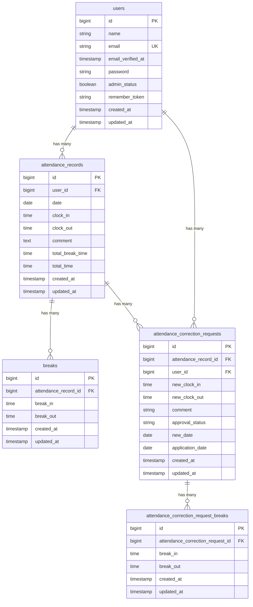

# COACHTECH 勤怠管理アプリ

Laravelを使用して開発した勤怠管理アプリです。
一般ユーザーは、出勤・休憩・退勤の打刻、勤怠情報の確認、勤怠修正申請、勤怠レポートの確認を行うことができます。
管理者は、スタッフの勤怠確認、スタッフ管理、勤怠修正申請の確認・承認を行うことができます。
また、勤怠情報を取得・登録・更新・削除できるAPIを実装しています。

## 作成者

石川浩子

## 使用技術

- PHP 8.2.33
- Laravel 10.50.3
- MySQL 8.4
- Docker Desktop
- Laravel Sail
- Laravel Fortify
- Laravel Sanctum
- Blade
- Vite
- PHPUnit

## ER図



## 開発環境URL

http://localhost

## 動作環境

Docker Desktop上でLaravel Sailを使用して開発しています。

PHP、MySQLなどをDockerコンテナ上で動作させています。

初期データとして、一般ユーザー2名と管理者1名が登録されています。

### 一般ユーザー1

- メールアドレス：user1@example.com
- パスワード：password

### 一般ユーザー2

- メールアドレス：user2@example.com
- パスワード：password

### 管理者

- メールアドレス：user3@example.com
- パスワード：password

## 環境構築手順

1. **リポジトリをクローン**

    ```bash
    git clone https://github.com/hiroko-kiriten/attendance-app.git
    cd attendance-app
    ```

2. **.envファイルの準備**

    `.env.example`をコピーして`.env`を作成します。

    ```bash
    cp .env.example .env
    ```

3. **Composer依存パッケージのインストール**

    ```bash
    composer install
    ```

4. **Laravel Sailの起動**

    ```bash
    ./vendor/bin/sail up -d
    ```

5. **アプリケーションキーの生成**

    ```bash
    ./vendor/bin/sail artisan key:generate
    ```

6. **データベースのマイグレーションと初期データ投入**

    ```bash
    ./vendor/bin/sail artisan migrate:fresh --seed
    ```

7. **フロントエンドのビルド**

    ```bash
    ./vendor/bin/sail npm install
    ./vendor/bin/sail npm run build
    ```

8. **アプリケーションへのアクセス**

    ブラウザから以下のURLにアクセスします。

    http://localhost

## テスト実行

```bash
./vendor/bin/sail artisan test
```

## 機能一覧

- 一般ユーザーの会員登録・ログイン・メール認証
- 出勤・休憩・退勤の打刻
- 勤怠一覧・勤怠詳細の確認
- 勤怠修正申請
- 勤怠レポートの確認
- 管理者によるスタッフ管理
- 管理者によるスタッフ別勤怠確認
- 管理者による勤怠修正申請の確認・承認
- 勤怠情報APIの取得・登録・更新・削除

## APIエンドポイント一覧

勤怠情報を取得・登録・更新・削除するAPIを提供しています。

GETによる取得系APIは認証不要です。

POST、PUT、DELETEによる更新系APIはSanctum認証が必要です。

| HTTPメソッド | URI | 概要 |
|---|---|---|
| GET | /api/v1/attendance-records | 勤怠一覧を取得 |
| GET | /api/v1/attendance-records/{attendanceRecord} | 勤怠詳細を取得 |
| POST | /api/v1/attendance-records | 勤怠を登録 |
| PUT | /api/v1/attendance-records/{attendanceRecord} | 勤怠を更新 |
| DELETE | /api/v1/attendance-records/{attendanceRecord} | 勤怠を削除 |
